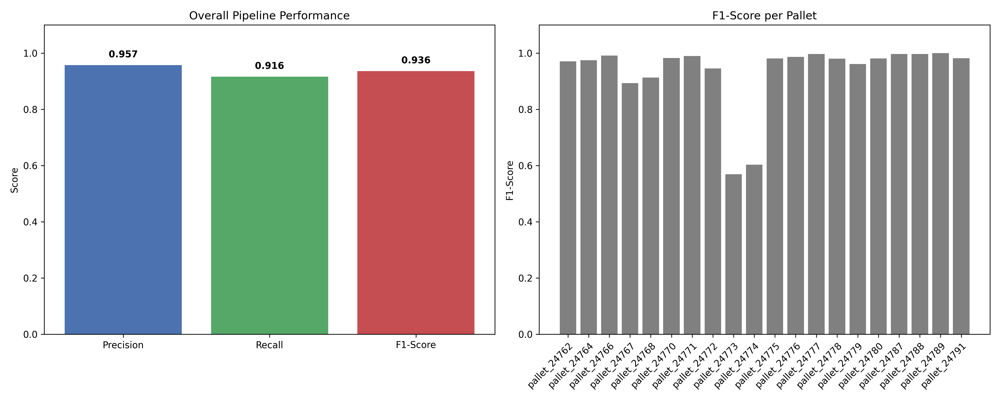
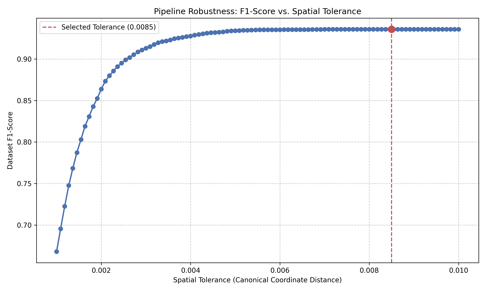
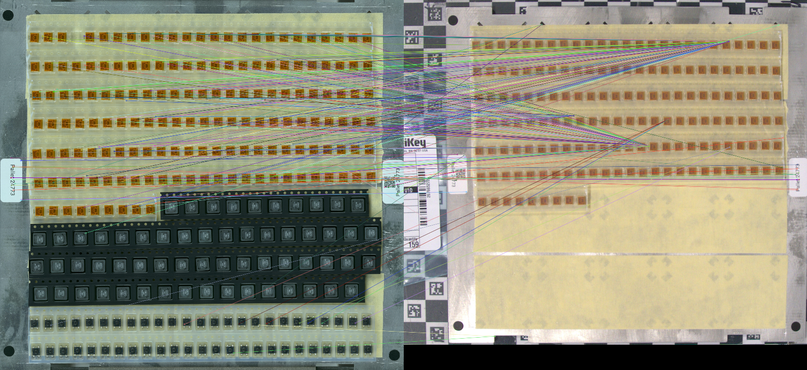

# CircuitDetector
A Proof-of-Concept (PoC) pipeline for automating the markup of electronic assembly pallets. This system processes a sequence of chronological stock images and a final high-resolution capture to accurately predict the canonical `(x, y)` locations of components and the exact `stock_index` frame when they were placed.

## How to Run

Navigate to the `CircuitDetector/src/` directory to run the scripts.

**Run on a Single Pallet:**
This will execute the full pipeline, generate the output CSV in `../results/results_csv/`, and print evaluation metrics for a specific pallet.
```bash
python single_pallet_run.py {pallet_number}

# Example:
python single_pallet_run.py 24771

```

**Run Full Dataset Evaluation:**
This will iterate through all pallets, aggregate the global metrics, save all CSVs, and generate performance graphs.

```bash
python final_eval.py

```

*Note: Evaluation graphs (`evaluation_results.png` and `tolerance_sweep.png`) will be saved in the `../results/` directory.*

---

## Architecture & Pipeline Overview

Given the ~6-hour timebox for this PoC, I designed a hybrid pipeline that utilises Machine Learning for complex spatial reasoning and Classical Computer Vision for fast temporal association.

### Phase 1: Spatial Detection (YOLO11s)

To find the components on the final board, I trained a custom YOLO object detector.

* **Data Generation:** I built a custom script to auto-generate a training dataset from the provided `locations.csv` and capture images. The script uses the metadata affine matrix to crop the valid pallet area, and dynamically calculates bounding box sizes based on component proximity to prevent overlapping boxes on dense arrays.
* **Training:** Trained on an RTX 3080 (24GB RAM) with a Ryzen 5 3600. This setup allowed a YOLO11s Nano model to converge in ~20 minutes, and a YOLO11s Small model in under an hour with robust spatial accuracy.

### Phase 2: Temporal Association (Homography + HSV Probing)

To determine *when* a part was placed (`stock_index`), I needed to map the high-res capture back to the perspective-distorted stock images.

* **Alignment:** I extracted the inner bounds of the checkerboard frame to dynamically crop the stock images. I then used **AKAZE** feature matching to compute a Homography matrix mapping the Master Capture to each Stock frame. *(Note: I experimented with SIFT, which was accurate but slow, and ORB, which was fast but not as precise. AKAZE provided the best balance of speed and feature stability).*
* **State Detection:** Using the Homography matrix, I projected the YOLO-detected coordinates onto the chronologic stock images. I then extracted a small patch under that coordinate and evaluated the HSV colour space to detect when the yellow pallet adhesive was physically covered by a component.

### Phase 3: Canonical Mapping

The final predicted pixel coordinates are multiplied by the inverse of the provided `pallet_metadata.json` affine matrix to map them back to the mathematical `[0.0, 1.0]` canonical space. The outputs are strictly clipped to these bounds and saved matching the ground-truth format.

---

## Evaluation Methodology & Tolerance Sweep

To rigorously evaluate the pipeline, I implemented a strict scoring system using the Hungarian matching algorithm.



For the baseline evaluation, I set the canonical spatial **tolerance to `0.0085**`. This value was intentionally chosen as it represents exactly half the length between the centres of the smallest component type from the dataset - `pallet_24771` (calculated using ground truth coordinate difference). This guarantees that no single prediction could accidentally bridge two adjacent pockets.

To prove the pipeline's robustness, I ran a spatial tolerance sweep:



As shown in the graph above, the pipeline maintains peak F1-score performance even when the spatial tolerance is restricted down to **`0.0050`**. So we can conclude that the tolerance can be lowered up to this limit without large reduction in performance.

---

## Design Decisions & Engineering Trade-offs

During development, several approaches were tested and discarded to optimise for the time constraint:

1. **Dataset Splitting & Data Leaks:** Due to the limited dataset size, I manually curated the Train, Validation, and Test splits. Initially, repeating pallets were distributed across all splits, with the most difficult (smallest) components prioritised for the Test set. Unique components (e.g., a CPU appearing on only one pallet) were placed exclusively in the Training set to ensure the model learned them.

   However, this created an evaluation blind spot: the model initially struggled with the CPU due to bounding box scaling, but validation metrics remained artificially high because the CPU was absent from the validation set. To resolve this and successfully hyperparameter-tune the model to accommodate *all* component geometries, I allowed up to a 20% data "leak" of these unique training pallets into the Validation and Test sets. 
   
   This leak was strictly unidirectional. Pure test/validation data never leaked back into the training set. Note that this was a PoC compromise to increase performance across rare classes, but given a larger production dataset, I would strictly isolate entire pallets and rely heavily on data augmentation to generalise the model.

2. **Checkerboard vs. Fiducials:** I initially attempted to align the images using the three circular fiducials on the pallet edges. However, classical OpenCV contour/circle detection struggled with lighting variations and motion blur in the stock images. I pivoted to geometric filtering of the checkerboard squares, which proved significantly more robust for establishing cropping boundaries.

3. **HSV Probing vs. `absdiff`:** My initial plan for temporal assignment was to warp the images and use `cv2.absdiff()` to find pixel changes between stock frames. This failed due to micro-shifts in the camera and variable exposure.

4. **HSV Probing vs. YOLO on Stock Images:** I also attempted running the YOLO detector directly on the stock images to build a chronological point-cloud. However, the lower resolution and motion blur in the stock sequence resulted in noisy, inconsistent bounding boxes that ruined the temporal F1-score.

Ultimately, projecting perfect high-resolution coordinates down to the stock images (homography) and utilising a targeted colour-space probe yielded the most stable PoC.

---

## ⚠️ Known Limitations & Production implementation

While the hybrid pipeline achieves excellent baseline metrics, it exposes the exact limitations of classical computer vision.

Performance Variance & Edge Cases
The pipeline demonstrated high accuracy across the vast majority of the dataset, achieving close to and sometimes perfect 1.0 F1-scores on a diverse set of components. However, performance dropped on 2 specific edge cases.

**`pallet_24773`**: This is was our worst performer at a 57% F1-score. The failure was not due to component detection, but rather the geometric anchoring. In this specific pallet, the tracking barcode sticker was applied to the opposite side of the frame compared to our reference capture image. Because the AKAZE algorithm aggressively anchors to high-contrast features, it anchored to the misplaced sticker, resulting in a mathematically valid but physically impossible Homography matrix that skewed the temporal projections.




**`pallet_24774`:** This pallet originally suffered from severe temporal noise. However, after implementing Signal Debouncing - a sliding look-ahead window that requires the yellow tape to be occluded for three consecutive frames before registering a state change, we successfully filtered out high-frequency noise like passing hands and single-frame matrix glitches. This boosted the recall to 60%. The remaining missed detections are due to transparent components blending into the yellow background, proving the limit of static HSV colour probing.

While the current AKAZE + Homography alignment serves as a reliable geometric backbone for most pallets, preparing this system for a production factory floor requires moving away from brittle heuristics.

#### Robust Geometric Alignment (Fixing the Barcode Edge Case)
The failure on pallet_2773 happened because AKAZE and standard RANSAC are completely blind to global context. They saw a perfect barcode on the left of the capture image, and a perfect barcode on the right of the stock image, and forcefully aligned them together. To fix this, we need an alignment approach that is immune to massive localised outliers.

A simple improvement would be to introduce a Static Pre-processing Mask that blacks out the center of the pallet and the known variable label zones. By passing this binary mask into AKAZE, we force the algorithm to completely ignore human-placed stickers and changing components. 

Alternatively, for a more permanent fix, we could replace AKAZE with a modern, context-aware Deep Learning feature matcher like LoFTR (Local Feature Network). LoFTR understands global spatial relationships, meaning it would instantly recognize that a barcode on the left doesn't physically belong to a barcode on the right, keeping the alignment strictly locked onto the actual grid of the pallet.

#### Automated Training Data Pipeline
Currently, the occasional homography shifts in this PoC would result in mislabeled data. However, once the geometric alignment is perfected, this deterministic pipeline gains a massive secondary use-case: generating training data.

As far as I am aware, the stock images and their component coordinates are not labelled unlike the pallet images. We can leverage this system to do it automatically. By taking the pallet image coordinates and mathematically projecting them backward through the chronological stock frames, we can automatically extract perfectly cropped datasets of "Empty" vs. "Filled" pockets.
This will be useful for training a model to detect empty pockets as explained below.

#### Deep Learning Classification (Replacing the HSV Probe)
The transparency issues on pallets like 24774 show the practical limits of relying on static color thresholds in a physical environment. However, because our homography pipeline can be used to automatically crop thousands of "empty" and "filled" pockets, we already have the perfect dataset to train a more resilient solution without over-engineering a complex temporal tracking system.

I recommend replacing the HSV check with a straightforward, lightweight image classifier (such as MobileNetV3 or a YOLO classification model). Instead of relying on hardcoded color values, a standard CNN will easily learn to spot the actual physical signs of a placed component—like the edges, cast shadows, and reflections created by transparent plastics—that a color filter simply cannot see. This gives us a highly reliable architecture that ignores factory lighting shifts and color-matched parts, while still being small enough to run in milliseconds on edge hardware.

#### Speed

Currently, the end-to-end inference time (ROI extraction, YOLO spatial detection, AKAZE homography across all stock frames, and temporal assignment) runs at approximately **5 seconds per pallet sequence**. Given that this system is designed to replace a manual, UI-driven click-and-annotate process, I did't focus on collecting much data on inference speed and further performance optimisations although there definitely is potential for improvement.
